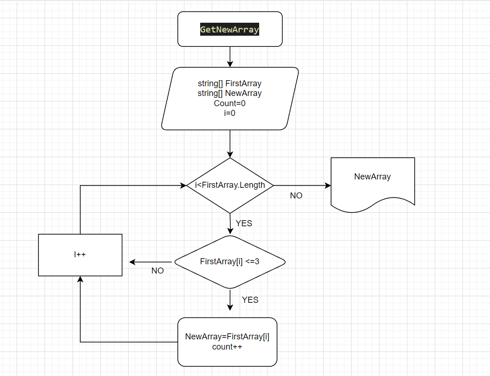

# Итоговая работа
Итоговая контрольная работа по основному блоку

### Задача: 
Написать программу, которая из имеющегося массива строк формирует новый массив из строк, длина которых меньше, либо равна 3 символам. Первоначальный массив можно ввести с клавиатуры, либо задать на старте выполнения алгоритма. При решении не рекомендуется пользоваться коллекциями, лучше обойтись исключительно массивами.

## Описание алгоритма решения: 

1) Создаем строковый массив
2) Создаем второй новый массив 
3) Добавляем метод получения нового массива *GetNewArray*, переносящий определенные элементы по условию задачи из начального массива в новый 
4) Выводим на экран новый массив *PrintArray*

## Дополнительная информация
Блок-схема решения задачи:

